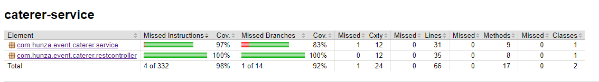

# Caterer-Service
It's Springboot application with Mongo, Kafka and spring-cache deployable on Kubernetes ecosystem.

## Technologies used:
Java 11, Lombok, Spring Boot(latest version 2.5.0), Swagger,
Yml(application properties), MongoDB, Springboot-kafka

### Packages
* configuration - consist of swagger and cors mapping configuration
* exception - consist of global exception handler for caterer-service app
* model - domain set mapping objects for caterer-service
* repository - database ineraction layer
* restcontroller - API interaction and handler layer
* service - business logic layer for caterer-service
* utils - consist of date time utility
* validator - custom input validation handler

### Test using Junit Mockito and Mock MVC
   
  
   
 92% of code coverage for service and restcontroller layer (JOCOCO plugin used to calculate the code coverage).

### API Documentation using Swagger
Access URL: http:localhost:8088/swagger-ui/ (Standalone spring boot)

### Key features
* HATEOS for API linkage, RESTful interaction is driven by hypermedia.
* Paginated result for an API, Also page size configurable using Kubernetes config file.
* Testing: Functional unit tests. Also integration tests for (Data persistence
layer, and rest api layer etc.) Usage of Mockito and Spring Boot Test and Mock MVC.
* REST API consumes/produces json data, Document the swagger api model and
response and also Validated the request payload.
* Logging: Log requests and responses payload using Slf4J.
* Error handling: Proper Exception handling with Error codes.
* Caching: Implemented data cache layer to improve performance for read queries using Spring Cache.
* Request payload validation: Validate the request payload and also checking the domain model
fields constraints using Javax.validation and Custom Validation Constraint.
 
 
